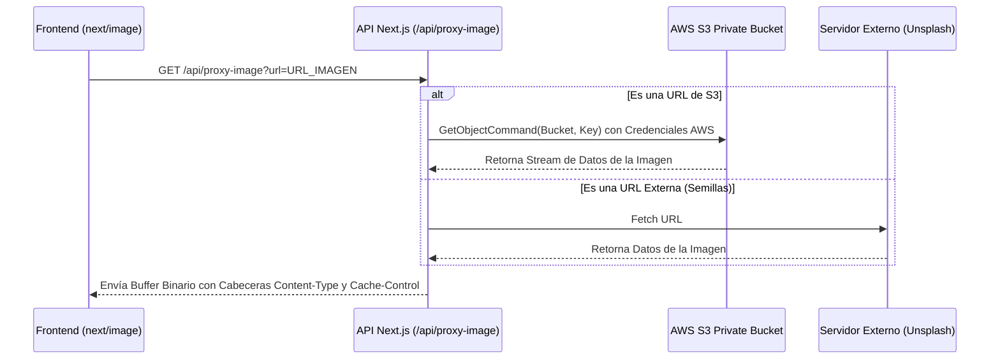

# HU2.1: Recuperación Segura de Imágenes desde S3 Privado

## 1. Identificador y Título
* **ID:** HU2.1
* **Título:** Recuperación Segura de Imágenes desde S3 Privado

---

## 2. Historia de Usuario
**Como** desarrollador y administrador del sistema,  
**Quiero** que el backend actúe como un proxy seguro para recuperar las imágenes almacenadas en el bucket privado de AWS S3 utilizando credenciales autenticadas,  
**Para** que el cliente (frontend) pueda visualizarlas mediante `next/image` de forma segura, sin exponer accesos públicos en el bucket ni credenciales en el cliente.

---

## 3. Criterios de Aceptación Funcionales
- [x] **Mapeo Automatizado:** Todas las imágenes que provienen del almacenamiento externo en S3 son interceptadas en el servidor y reescritas para apuntar al proxy local `/api/proxy-image`.
- [x] **Acceso Autenticado por Servidor:** La obtención de objetos desde S3 se realiza exclusivamente mediante el SDK de AWS en el servidor (`GetObjectCommand`) utilizando las credenciales privadas (Access Key ID y Secret Access Key).
- [x] **Mecanismo de Fallback para Seeds:** Si la URL de la prenda no pertenece al dominio de S3 (por ejemplo, imágenes cargadas en el archivo `seed.ts` desde Unsplash), el proxy utiliza una petición `fetch` estándar en el servidor.
- [x] **Caché Persistente:** Respuesta con cabeceras `Cache-Control: public, max-age=31536000, immutable` para optimizar el tráfico y costo de peticiones de lectura hacia AWS S3.
- [x] **Seguridad de next/image:** Configuración del proxy local en `images.localPatterns` dentro de `next.config.ts` para autorizar la optimización local de las imágenes.

---

## 4. Especificación Técnica y Arquitectura

### A. Flujo de Datos Arquitectónico
El siguiente diagrama detalla la interacción entre el cliente, el backend de Next.js y el servicio privado de AWS S3:



### B. Implementación del Servidor: `app/api/proxy-image/route.ts`
El backend detecta de forma dinámica el patrón de URL del bucket privado de AWS S3 (`https://[bucket].s3.[region].amazonaws.com/[key]`). 

Al coincidir, instancia el cliente de AWS S3, firma y descarga el objeto binario:

```typescript
import { NextRequest, NextResponse } from 'next/server';
import { S3Client, GetObjectCommand } from '@aws-sdk/client-s3';

const s3Client = new S3Client({
  region: process.env.AWS_REGION || 'us-east-1',
  credentials: {
    accessKeyId: process.env.AWS_ACCESS_KEY_ID || '',
    secretAccessKey: process.env.AWS_SECRET_ACCESS_KEY || '',
  },
});

export async function GET(request: NextRequest) {
  const { searchParams } = new URL(request.url);
  const url = searchParams.get('url');

  if (!url) return new NextResponse('URL missing', { status: 400 });

  const s3UrlPattern = /^https:\/\/([^.]+)\.s3\.([^.]+)\.amazonaws\.com\/(.+)$/;
  const match = url.match(s3UrlPattern);

  if (match) {
    const bucketName = match[1];
    const region = match[2];
    const key = decodeURIComponent(match[3]);

    try {
      const s3Response = await s3Client.send(new GetObjectCommand({ Bucket: bucketName, Key: key }));
      const contentType = s3Response.ContentType || 'image/jpeg';
      const bytes = await s3Response.Body.transformToByteArray();

      return new NextResponse(Buffer.from(bytes), {
        headers: {
          'Content-Type': contentType,
          'Cache-Control': 'public, max-age=31536000, immutable',
        },
      });
    } catch (e) {
      // Fallback
    }
  }

  // Fallback para Unsplash u otras URLs estáticas
  const response = await fetch(url);
  const arrayBuffer = await response.arrayBuffer();
  return new NextResponse(Buffer.from(arrayBuffer), {
    headers: {
      'Content-Type': response.headers.get('content-type') || 'image/jpeg',
      'Cache-Control': 'public, max-age=31536000, immutable',
    },
  });
}
```

---

## 5. Casos de Prueba y QA

### Escenario 1: Imagen Privada en S3 (Flujo Principal)
* **Condición:** Se renderiza una prenda con imagen en `https://personal.dragodo.cloud.s3.us-east-1.amazonaws.com/estilos/superior/img.png`.
* **Proceso:** El servidor reescribe la imagen a `/api/proxy-image?url=...`. El proxy utiliza el SDK de AWS firmado para traer la imagen.
* **Resultado:** La imagen se despliega correctamente en el navegador con código HTTP 200 y cabeceras de caché.

### Escenario 2: Imagen Estática de Seeds (Compatibilidad)
* **Condición:** Se renderiza la prenda de prueba con URL `https://images.unsplash.com/...`.
* **Proceso:** El proxy detecta que no es de S3 y realiza un `fetch` directo en el servidor.
* **Resultado:** La imagen se despliega sin problemas de hostname ni políticas CORS en el frontend.
